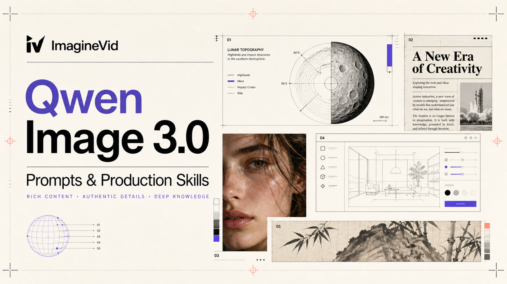
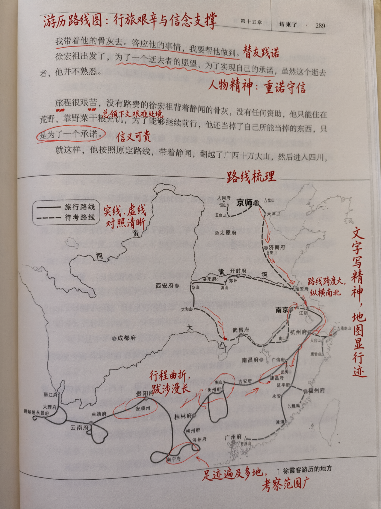
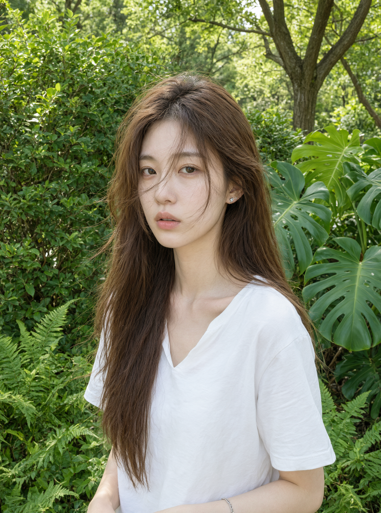

<a href="https://github.com/imagineVid/Awesome-qwen-image-3-0-prompts-and-skills"></a>

# Awesome Qwen Image 3.0 Prompts & Skills

> Casi ufficiali di Qwen Image 3.0 ricostruiti come prompt di produzione riutilizzabili in inglese, con media verificabili e attribuzione trasparente.

[](https://github.com/sindresorhus/awesome) [](LICENSE) [](https://github.com/imagineVid/Awesome-qwen-image-3-0-prompts-and-skills)

[English](README.md) · [简体中文](README.zh.md) · [日本語](README.ja.md) · [한국어](README.ko.md) · [Español](README.es.md) · [Deutsch](README.de.md) · [Français](README.fr.md) · [**Italiano**](README.it.md) · [Português](README.pt.md) · [Nederlands](README.nl.md) · [Polski](README.pl.md) · [Русский](README.ru.md) · [Türkçe](README.tr.md) · [العربية](README.ar.md)

---

## Indice

- [Guida al modello](#model-guide)
- [Indice dei workflow](#workflow-index)
- [Casi ufficiali verificati](#verified-showcase-cases)
- [Contribuisci](#contribute)
- [Licenza e attribuzione](#license-and-attribution)

<a id="model-guide"></a>

## Guida al modello

Qwen Image 3.0 è la terza generazione del modello di generazione e modifica delle immagini del team Qwen. Il lancio ufficiale ruota attorno a contenuti ricchi, dettagli autentici e conoscenza profonda. Qwen dichiara istruzioni fino a 4,5K token, testo di 10 pixel, rendering nativo in 12 lingue, oltre 100 stili artistici, interfacce complesse e modifica con immagini di riferimento. Questa raccolta converte le demo ufficiali in prompt di produzione inglesi completi e distingue tali capacità come dichiarazioni del produttore, non risultati indipendenti.

> I prompt restano in inglese affinché ogni lingua condivida una versione canonica riproducibile.

### Cosa verifica questa raccolta

- Pubblicazioni dense a più pannelli e istruzioni strutturate lunghe
- Testo minuto, formule, annotazioni e tipografia multilingue
- Texture realistiche di pelle, capelli, carta, tessuti e materiali
- Modifica con riferimenti, restauro, simulazione di interfacce e grafici informativi

### Base della ricerca

- [Qwen Image 3.0 official launch](https://qwen.ai/blog?id=qwen-image-3.0)
- [Qwen image creation workspace](https://chat.qwen.ai/?inputFeature=t2i)

**[Crea immagini su ImagineVid](https://imaginevid.io/it/ai-image-generator)**

<a id="workflow-index"></a>

## Indice dei workflow

- **Design dell'informazione long-form**
- **Tipografia e pubblicazione**
- **Interfacce e conoscenza del mondo**
- **Fotorealismo e dettaglio dei materiali**
- **Modifica e restauro con riferimenti**

<a id="verified-showcase-cases"></a>

## Casi ufficiali verificati

| Stato della raccolta | 19 casi verificati |
|---|---:|
| Ultima generazione | 2026-07-21 |

### 1. Atlante di nove discipline in una sola generazione

Una tavola educativa 3×3 per istruzioni lunghe, separazione semantica, formule, diagrammi e testo bilingue leggibile.

#### Prompt

```text
Create one landscape 3x3 educational knowledge atlas titled "NINE WAYS TO EXPLAIN A COMPLEX WORLD." Every cell must be a complete mini-infographic with its own visual language while remaining part of one coherent publication.

Row one: a tunnel-safety comic with numbered emergency actions; a spatial-geometry lesson explaining a plane intersecting a cube; and a literary analysis of the classical memorial Chu Shi Biao with a restrained calligraphy excerpt and rhetorical map. Row two: projectile-motion physics with a trajectory graph and equations; a parasitology life-cycle explainer; and a clinical decision diagram for right-side chest pain with clearly marked non-diagnostic educational language. Row three: an introduction to the Sylow theorems; a bank internal-control process map; and a comparison of prokaryotic and eukaryotic DNA organization.

Use exact section boundaries, consistent outer margins, clear titles, concise English labels with selected Chinese terms where useful, correct mathematical notation, and distinct color coding for each discipline. Preserve small-text readability, avoid repeated icons and pseudo-text, and make the entire atlas look like one premium educational supplement rather than nine unrelated cards. 16:9, print-sharp detail.
```

<table><tr>
<td width="100%"></td>
</tr></table>

#### Prova della fonte

- **Autore:** [Qwen Team](https://qwen.ai/)
- **Esempio ufficiale:** [Qwen Image 3.0](https://qwen.ai/blog?id=qwen-image-3.0)
- **Pubblicato:** 2026-07-21
- **Categoria:** Design dell'informazione long-form
- **Immagini di riferimento necessarie:** No

**[Usa questo prompt su ImagineVid](https://imaginevid.io/it/ai-image-generator)**

---

### 2. Interfacce software annidate

Quattro ambienti riconoscibili in una composizione continua che ne preserva la gerarchia.

#### Prompt

```text
Create a realistic desktop screenshot built as four nested interfaces, each visibly contained inside the previous one. The outer layer is a dark VS Code workspace with a clean project tree, open TypeScript file, terminal, and status bar. Inside its editor preview, show a Qwen chat interface answering a design question. Inside that answer, embed a mobile WeChat conversation sharing a coffee recipe. Inside the shared message, display a polished pour-over coffee poster with a brewer diagram, a 1:16 ratio, water temperature, and a four-step pouring timeline.

The nesting must read instantly from outer to inner: code editor, AI chat, messaging app, poster. Preserve realistic window chrome, spacing, typography scale, cursor states, and device proportions. Use concise, fully legible English interface copy; do not imitate private user data or real account names. Avoid impossible window overlaps, repeated controls, gibberish code, excessive reflections, and generic sci-fi dashboards. 16:9 desktop composition, neutral studio clarity.
```

<table><tr>
<td width="100%"></td>
</tr></table>

#### Prova della fonte

- **Autore:** [Qwen Team](https://qwen.ai/)
- **Esempio ufficiale:** [Qwen Image 3.0](https://qwen.ai/blog?id=qwen-image-3.0)
- **Pubblicato:** 2026-07-21
- **Categoria:** Interfacce e conoscenza del mondo
- **Immagini di riferimento necessarie:** No

**[Usa questo prompt su ImagineVid](https://imaginevid.io/it/ai-image-generator)**

---

### 3. Guida scientifica allo squalo balena

Un'infografica marina densa che integra anatomia, migrazione, scala, dieta e conservazione.

#### Prompt

```text
Design a tall scientific field guide titled "WHALE SHARK: THE OCEAN'S GENTLE GIANT." Place an anatomically accurate whale shark as the central specimen and organize the supporting information around it in a disciplined museum-publication grid.

Include a dorsal and side silhouette, labeled external anatomy, spot-pattern identification, filter-feeding mechanism, human scale comparison, global warm-water range map, seasonal migration path, life-stage timeline, and a compact conservation section. Use concise English labels and clearly separate established facts from uncertain estimates. Add a small panel explaining how researchers use photographic spot matching, plus a measurement strip for length and mouth width.

Style: contemporary natural-history illustration with deep ocean blue, muted cyan, warm white, and restrained coral accents. Mix precise ink diagrams with realistic underwater texture. Keep all small labels crisp, use consistent leader lines, and avoid fantasy anatomy, sensational claims, decorative bubbles, fake citations, or duplicated fish. 2:3 portrait, publication-ready.
```

<table><tr>
<td width="100%"></td>
</tr></table>

#### Prova della fonte

- **Autore:** [Qwen Team](https://qwen.ai/)
- **Esempio ufficiale:** [Qwen Image 3.0](https://qwen.ai/blog?id=qwen-image-3.0)
- **Pubblicato:** 2026-07-21
- **Categoria:** Design dell'informazione long-form
- **Immagini di riferimento necessarie:** No

**[Usa questo prompt su ImagineVid](https://imaginevid.io/it/ai-image-generator)**

---

### 4. Articolo di geometria algebrica con impaginazione precisa

Una prova editoriale per struttura matematica, notazione simile a LaTeX, teoremi e testo minuto.

#### Prompt

```text
Create one realistic A4 page from a peer-reviewed algebraic geometry paper titled "Derived Intersections on Singular Moduli Spaces." Use a restrained academic journal template with author line, abstract, numbered section heading, theorem, proof, one commutative diagram, and a short bibliography fragment.

The page must contain coherent mathematical notation rather than decorative symbols: superscripts and subscripts, fractions, direct sums, sheaf notation, morphism arrows, aligned multi-line equations, braces, Greek letters, and equation numbers. Set a clearly distinguished "Theorem 2.3" followed by a short proof with logically consistent notation. Include one square commutative diagram whose arrows and object labels align correctly.

Render as black ink on slightly warm archival paper with subtle print texture and no handwriting. Maintain professional margins, baseline rhythm, serif body text, monospaced operator names where appropriate, and sharp small type. Do not invent institutional logos, fake DOI numbers, malformed equations, random glyphs, or ornamental science imagery.
```

<table><tr>
<td width="100%"></td>
</tr></table>

#### Prova della fonte

- **Autore:** [Qwen Team](https://qwen.ai/)
- **Esempio ufficiale:** [Qwen Image 3.0](https://qwen.ai/blog?id=qwen-image-3.0)
- **Pubblicato:** 2026-07-21
- **Categoria:** Tipografia e pubblicazione
- **Immagini di riferimento necessarie:** No

**[Usa questo prompt su ImagineVid](https://imaginevid.io/it/ai-image-generator)**

---

### 5. Prima pagina di un quotidiano domenicale

Una composizione stampata che coordina articoli, fotografie, colonne, didascalie e carta realistica.

#### Prompt

```text
Generate a photorealistic broadsheet newspaper front page named "THE HARBOR REVIEW" dated Sunday, July 19, 2026. The lead story is "A CITY LEARNS TO LIVE WITH WATER" and examines flood-resilient public space through one large documentary photograph, a concise standfirst, and a five-column article opening.

Add three secondary stories: a regional rail map redesign, a profile of a neighborhood instrument maker, and a science brief about kelp-forest recovery. Include a narrow weather strip, issue price, page references, bylines, captions, and one restrained data graphic. Use editorially plausible but fictional copy; no real newspaper mastheads or fabricated quotes attributed to real people.

The newspaper should lie naturally on a wooden cafe table with a slight fold, subtle ink variation, fine paper fibers, and soft morning window light. Preserve a strict typographic hierarchy, aligned columns, readable headlines and captions, and realistic print density. Avoid lorem ipsum, duplicated paragraphs, warped page edges, glossy magazine stock, or sensational tabloid styling.
```

<table><tr>
<td width="100%"></td>
</tr></table>

#### Prova della fonte

- **Autore:** [Qwen Team](https://qwen.ai/)
- **Esempio ufficiale:** [Qwen Image 3.0](https://qwen.ai/blog?id=qwen-image-3.0)
- **Pubblicato:** 2026-07-21
- **Categoria:** Tipografia e pubblicazione
- **Immagini di riferimento necessarie:** No

**[Usa questo prompt su ImagineVid](https://imaginevid.io/it/ai-image-generator)**

---

### 6. Annotazioni di studio scritte a mano

Modifica con riferimento che aggiunge note credibili senza alterare pagina, testo, luce o prospettiva.

#### Prompt

```text
Using the supplied photograph of an open textbook page as the only structural reference, add realistic red-ink study annotations without changing the printed page. Underline two key sentences, circle three important terms, add one wavy emphasis line, draw two short arrows linking a definition to its example, and write four concise handwritten comments in the margins: "review this", "key distinction", "exam example", and "connect to chapter 4".

The handwriting should look like one careful high-school student's natural pen work: consistent pressure, slight variation in slant, small corrections, and marks that follow the page perspective. Preserve every printed word, diagram, page edge, shadow, paper texture, camera angle, and background object exactly. Do not cover important content, regenerate the book, straighten the photograph, change the lighting, add highlighter, or introduce digital-looking vector strokes.
```

<table><tr>
<td width="50%"></td>
<td width="50%"></td>
</tr></table>

#### Prova della fonte

- **Autore:** [Qwen Team](https://qwen.ai/)
- **Esempio ufficiale:** [Qwen Image 3.0](https://qwen.ai/blog?id=qwen-image-3.0)
- **Pubblicato:** 2026-07-21
- **Categoria:** Modifica e restauro con riferimenti
- **Immagini di riferimento necessarie:** Sì

**[Usa questo prompt su ImagineVid](https://imaginevid.io/it/ai-image-generator)**

---

### 7. Ritratto alla finestra senza ritocco

Ritratto editoriale dedicato a pori, capelli fini, occhi umidi, colore sobrio e ottica credibile.

#### Prompt

```text
Create an intimate editorial head-and-shoulders portrait of a fictional adult woman standing beside a north-facing apartment window after light rain. Frame her slightly off-center at eye level with an 85mm full-frame lens look and shallow but not extreme depth of field.

Show honest skin texture: visible pores, fine facial hair, subtle under-eye variation, tiny freckles, a faint healed blemish, and natural lip texture. A few damp strands of dark hair should cross the forehead and catch the window light. Keep both irises detailed and moist without glassy over-sharpening. Wardrobe is a simple charcoal cotton shirt; background is a quiet soft-gray interior with one out-of-focus plant.

Use soft directional daylight, restrained neutral color, realistic dynamic range, and documentary magazine finishing. No beauty retouching, skin smoothing, makeup-ad gloss, waxy highlights, excessive bokeh, jewelry, text, visible brand marks, or impossible eyelashes. The subject must be fictional and not resemble a known person. 4:5 portrait.
```

<table><tr>
<td width="50%"></td>
<td width="50%"></td>
</tr></table>

#### Prova della fonte

- **Autore:** [Qwen Team](https://qwen.ai/)
- **Esempio ufficiale:** [Qwen Image 3.0](https://qwen.ai/blog?id=qwen-image-3.0)
- **Pubblicato:** 2026-07-21
- **Categoria:** Fotorealismo e dettaglio dei materiali
- **Immagini di riferimento necessarie:** No

**[Usa questo prompt su ImagineVid](https://imaginevid.io/it/ai-image-generator)**

---

### 8. Restauro di un dipinto a inchiostro con aquile

Ricostruzione delle parti danneggiate conservando età, composizione e ritmo del pennello.

#### Prompt

```text
Restore the supplied damaged Chinese ink painting of eagles in combat as a museum-conservation visualization. Reconstruct only the missing or mold-damaged regions by continuing the nearest original brushwork, paper tone, ink density, feather structure, branch rhythm, and negative-space composition.

The repaired eagle anatomy must remain consistent with the surviving head, wings, talons, and motion. Continue dry-brush feather edges where visible, use soft ink wash for atmospheric depth, and preserve the original balance between black ink, diluted gray, and untouched paper. Remove isolated mold spots and tears only where they interrupt the image; retain believable age, paper fibers, mild tonal variation, and all undamaged marks.

Do not modernize the painting, increase global contrast, add a new signature or seal, invent scenery, crop the sheet, alter the composition, erase all patina, or turn the repair into smooth digital illustration. Output the restored full sheet photographed flat under neutral conservation lighting.
```

<table><tr>
<td width="50%"></td>
<td width="50%"></td>
</tr></table>

#### Prova della fonte

- **Autore:** [Qwen Team](https://qwen.ai/)
- **Esempio ufficiale:** [Qwen Image 3.0](https://qwen.ai/blog?id=qwen-image-3.0)
- **Pubblicato:** 2026-07-21
- **Categoria:** Modifica e restauro con riferimenti
- **Immagini di riferimento necessarie:** Sì

**[Usa questo prompt su ImagineVid](https://imaginevid.io/it/ai-image-generator)**

---

### 9. Serie di manifesti culturali in tre lingue

Un'identità condivisa che verifica la tipografia nativa giapponese, coreana e spagnola.

#### Prompt

```text
Design a coordinated series of three vertical cultural posters for one fictional international night market. Each poster uses the same event facts but is art-directed for its language and city context.

Poster one, Japanese: title "夜の市場", subtitle "食・音楽・手仕事", date "2026年9月12日", location "港区文化広場". Use disciplined contemporary Japanese editorial typography with indigo, vermilion, and warm paper. Poster two, Korean: title "밤의 시장", subtitle "음식 · 음악 · 공예", date "2026년 9월 12일", location "문화광장". Use clear Hangul hierarchy with black, cobalt, and soft mint. Poster three, Spanish: title "MERCADO NOCTURNO", subtitle "Comida · Música · Oficios", date "12 de septiembre de 2026", location "Plaza de la Cultura". Use expressive modernist typography with coral, black, and pale yellow.

Keep all required text exact and readable, preserve shared event identity through one small geometric symbol and consistent information order, and avoid mixing scripts, fake glyphs, tourism clichés, national flags, or translated copy leaking between posters.
```

<table><tr>
<td width="50%"></td>
<td width="50%"></td>
</tr></table>

#### Prova della fonte

- **Autore:** [Qwen Team](https://qwen.ai/)
- **Esempio ufficiale:** [Qwen Image 3.0](https://qwen.ai/blog?id=qwen-image-3.0)
- **Pubblicato:** 2026-07-21
- **Categoria:** Tipografia e pubblicazione
- **Immagini di riferimento necessarie:** No

**[Usa questo prompt su ImagineVid](https://imaginevid.io/it/ai-image-generator)**

---

### 10. Regia per il live commerce

Interfaccia produttiva che organizza video, prodotti, moderazione, inventario e risultati secondo priorità reali.

#### Prompt

```text
Create a high-fidelity desktop interface for a fictional live-commerce production suite named "Northstar Live". The central area shows a 16:9 livestream preview of a presenter demonstrating a compact espresso machine in a bright studio. Surround it with production controls that follow a real operator's hierarchy rather than a generic dashboard.

Left rail: scene list, camera sources, lower thirds, product overlays, and media bin. Right panel: active product card with price, inventory, pinned offer, moderation queue, and compact live chat. Bottom timeline: microphone and music meters, cue markers, clip replay, and stream-health indicators. Top bar: elapsed time, viewer count, connection status, record state, and an emergency stop control separated from routine actions. Include a small performance panel for conversion, click-through, and stock velocity using plausible fictional data.

Use neutral light-gray surfaces, sharp black type, blue operational states, amber warnings, and red only for destructive or live states. Keep all labels legible and consistent. Avoid copied platform branding, impossible analytics, excessive rounded cards, dark cyberpunk styling, random charts, or decorative controls without function.
```

<table><tr>
<td width="50%"></td>
<td width="50%"></td>
</tr></table>

#### Prova della fonte

- **Autore:** [Qwen Team](https://qwen.ai/)
- **Esempio ufficiale:** [Qwen Image 3.0](https://qwen.ai/blog?id=qwen-image-3.0)
- **Pubblicato:** 2026-07-21
- **Categoria:** Interfacce e conoscenza del mondo
- **Immagini di riferimento necessarie:** No

**[Usa questo prompt su ImagineVid](https://imaginevid.io/it/ai-image-generator)**

---

### 11. Dalla foto di un insetto alla tavola scientifica

Modifica che conserva l'esemplare e aggiunge tassonomia, anatomia, ingrandimenti e scala.

#### Prompt

```text
Transform the supplied macro photograph of an insect into a publication-ready entomology plate while preserving the exact specimen, pose, camera angle, body proportions, colors, lighting, and background relationship.

Keep the original photograph as the dominant central panel. Add a clean taxonomic header with placeholders clearly marked for expert verification: "Order: [VERIFY]", "Family: [VERIFY]", "Genus: [VERIFY]". Create three magnified inset views derived from the same specimen: antenna structure, wing venation, and leg articulation. Add fine leader lines labeling head, compound eye, antenna, thorax, forewing, hindwing, abdomen, femur, tibia, and tarsus. Include a calibrated-looking scale bar labeled "Scale bar: verify against capture metadata" rather than inventing a measurement.

Use a warm-white scientific-journal background, graphite rules, restrained forest-green accents, exact alignment, and compact readable type. Do not change the insect, hallucinate hidden anatomy, assign an unverified species, add decorative leaves, or turn the plate into a children's poster.
```

<table><tr>
<td width="50%"></td>
<td width="50%"></td>
</tr></table>

#### Prova della fonte

- **Autore:** [Qwen Team](https://qwen.ai/)
- **Esempio ufficiale:** [Qwen Image 3.0](https://qwen.ai/blog?id=qwen-image-3.0)
- **Pubblicato:** 2026-07-21
- **Categoria:** Modifica e restauro con riferimenti
- **Immagini di riferimento necessarie:** Sì

**[Usa questo prompt su ImagineVid](https://imaginevid.io/it/ai-image-generator)**

---

### 12. Diretta di storia dell'arte fra epoche

Scena educativa che combina conoscenza storica, interfaccia moderna e chiara indicazione di finzione.

#### Prompt

```text
Create a fictional educational livestream titled "BRUSHWORK ACROSS WORLDS" in which respectful illustrated representations of Qi Baishi and Vincent van Gogh discuss how artists build motion with marks. Frame the scene as an art-history interpretation, not a real event or endorsement.

The two artists sit at a split studio table: the left side uses rice paper, ink stone, shrimp studies, and open negative space; the right side uses thick oil paint, reed pens, a night-sky color study, and visible impasto samples. Between them, place a neutral display comparing four concepts: line economy, directional stroke, color rhythm, and the role of empty space. The livestream interface should include a clear "FICTIONAL EDUCATIONAL RECREATION" label, chapter markers, translated captions, and a small source-notes panel without fabricated quotations.

Use museum-quality editorial illustration rather than photoreal impersonation. Preserve period-appropriate clothing and tools, balanced representation, readable English labels, and a calm educational tone. Avoid meme styling, commercial product promotion, false direct quotes, copied platform branding, or claims that the historical artists used modern technology.
```

<table><tr>
<td width="100%"></td>
</tr></table>

#### Prova della fonte

- **Autore:** [Qwen Team](https://qwen.ai/)
- **Esempio ufficiale:** [Qwen Image 3.0](https://qwen.ai/blog?id=qwen-image-3.0)
- **Pubblicato:** 2026-07-21
- **Categoria:** Interfacce e conoscenza del mondo
- **Immagini di riferimento necessarie:** No

**[Usa questo prompt su ImagineVid](https://imaginevid.io/it/ai-image-generator)**

---

### 13. Manga monocromatico a due vignette con dialoghi giapponesi esatti

Ricostruzione produttiva da un caso della community per verificare continuità, segno sobrio, testo verticale e balloon precisi.

#### Prompt

```text
Create a finished black-and-white manga page titled "目次だけの夜" using two wide horizontal panels stacked vertically. The characters are fictional adult online creators and must not resemble real people or copyrighted characters.

Top panel: over-the-shoulder view of a dark-haired creator wearing cat-ear headphones and a track jacket, seated in a dim bedroom and facing a monitor. On the monitor, a pale-haired creator appears in a sparse video-call frame. Add exactly two vertical speech bubbles: the person on the monitor says "……ごめん" and the seated person says "昨日の配信の話しよ".

Bottom panel: closer three-quarter view of the pale-haired creator wearing large headphones and a light hoodie, softly holding a thin translucent booklet. Only a table of contents is visible; the other pages contain no readable body text. Faint particles of light dissolve from the pages. The dark-haired creator appears only as a tiny chibi silhouette at the lower-left edge with dot eyes. Add exactly three vertical speech bubbles: "あらすじしか残ってないんだ", "日記の目次だけ持ってるみたいな", and the chibi reply "……ワロタ".

Use clean seinen-manga linework, natural gray screentone, controlled white space, consistent clothing and headphone design across both panels, clear right-to-left reading order, and crisp natural Japanese lettering. Keep every quoted string exact. No color, no extra bubbles, no garbled glyphs, no logos, no watermarks, and no additional characters. 3:2 landscape page.
```

<table><tr>
<td width="50%"></td>
<td width="50%"></td>
</tr></table>

#### Prova della fonte

- **Autore:** [Yasun](https://x.com/yasun_ai)
- **Esempio ufficiale:** [Qwen Image 3.0](https://x.com/yasun_ai/status/2079531572919996636)
- **Pubblicato:** 2026-07-21
- **Categoria:** Tipografia e pubblicazione
- **Immagini di riferimento necessarie:** No

**[Usa questo prompt su ImagineVid](https://imaginevid.io/it/ai-image-generator)**

---

### 14. Ascesa subacquea verso un unico fascio di luce

Ricostruzione comunitaria incentrata su tessuto sommerso, anatomia credibile, profondità delle particelle, spazio negativo e mani tese.

#### Prompt

```text
Create a vertical cinematic underwater photograph of a fictional adult woman suspended in deep dark-blue water. She wears a translucent layered white dress that drifts naturally around her body. Her long black hair fans sideways with the current. Position her in the lower-middle of the frame, looking upward and extending one arm toward a narrow shaft of white light descending from the surface. From the darkness below, many pale hands reach upward without touching her; vary their scale and focus to create depth while keeping every hand anatomically plausible. Fine bubbles and particles catch the overhead light. Use cold cyan highlights, deep navy negative space, realistic water attenuation, restrained contrast, and a quiet surreal mood. Full-body vertical composition, no gore, no extra limbs on the main subject, no text, no logos, no watermark.
```

<table><tr>
<td width="100%"></td>
</tr></table>

#### Prova della fonte

- **Autore:** [Zidan](https://x.com/liluocheng13)
- **Esempio ufficiale:** [Qwen Image 3.0](https://x.com/liluocheng13/status/2079857838676209967)
- **Pubblicato:** 2026-07-22
- **Categoria:** Fotorealismo e dettaglio dei materiali
- **Immagini di riferimento necessarie:** No

**[Usa questo prompt su ImagineVid](https://imaginevid.io/it/ai-image-generator)**

---

### 15. Editor di codice annidato e poster in chat

Prompt UI a livelli per testare testo leggibile, profondita spaziale e generazione di un poster dentro una chat.

#### Prompt

```text
Create a layered picture-in-picture interface scene with strong visual depth. The outer layer is a realistic VS Code programming workspace on a desktop monitor. Inside that workspace, show a Qwen-style chat application window where the user is sending the message: "Create a hand-brewed coffee poster." The assistant reply contains a polished coffee poster, and the poster remains clearly visible inside the chat window.

Keep every layer visually distinct: code editor chrome, chat sidebar, message bubbles, poster frame, toolbar buttons, timestamps, and small UI labels. Make the micro-text crisp enough to read, avoid distorted pseudo-letters, preserve realistic spacing, and use clean modern interface lighting. The coffee poster should feel like a premium specialty-cafe campaign with warm paper texture, elegant typography, roasted-bean details, and a clear headline. 16:9, high-resolution, sharp layout.
```

<table><tr>
<td width="50%"></td>
<td width="50%"></td>
</tr></table>

#### Prova della fonte

- **Autore:** [比特小师妹｜KiKi](https://x.com/bit_sister)
- **Esempio ufficiale:** [Qwen Image 3.0](https://x.com/bit_sister/status/2080577815376957798)
- **Pubblicato:** 2026-07-24
- **Categoria:** Fotorealismo e dettaglio dei materiali
- **Immagini di riferimento necessarie:** No

**[Usa questo prompt su ImagineVid](https://imaginevid.io/it/ai-image-generator)**

---

### 17. Ritratto coquette vintage con riferimento

Prompt ritratto guidato da riferimento per conservare identita, pelle realistica, stile rosa antico e inquadratura editoriale ravvicinata.

#### Prompt

```text
Use the attached image as the main facial reference while preserving recognizable identity, natural facial proportions, facial harmony, realistic skin texture, visible pores, and subtle natural asymmetry.

Create a premium extreme close-up studio beauty portrait using a dreamy vintage coquette rendering style, translated into a richer old-rose editorial palette. Frame tightly from the upper shoulders upward. Use soft diffused key light, pearl highlights, muted rose makeup, delicate lace or satin styling, shallow depth of field, and refined film-grain texture. Keep the expression calm and natural, preserve believable eyes and hair detail, avoid over-smoothed skin, and make the result feel like a high-end magazine beauty cover rather than a plastic retouch. Square format, crisp detail.
```

<table><tr>
<td width="50%"></td>
<td width="50%"></td>
</tr></table>

#### Prova della fonte

- **Autore:** [Rich · Atom Tan Studio](https://x.com/atomtanstudio)
- **Esempio ufficiale:** [Qwen Image 3.0](https://x.com/atomtanstudio/status/2080197723429711958)
- **Pubblicato:** 2026-07-23
- **Categoria:** Fotorealismo e dettaglio dei materiali
- **Immagini di riferimento necessarie:** Sì

**[Usa questo prompt su ImagineVid](https://imaginevid.io/it/ai-image-generator)**

---

### 18. Modifica dell’identità di una rockstar ribelle

Un caso basato su fonti verificabili che esplora «Modifica dell’identità di una rockstar ribelle», con istruzioni riutilizzabili e media del risultato ispezionabili.

#### Prompt

```text
Candid photography. Use facial identity, facial geometry and make-up but not original hair from [uploaded image] to create a rebellious female rockstar with an hourglass figure. Her new hair is long, blonde and professionally styled with a side-parting. She wears a strapless black sequin pencil-dress and black leather high-heels with 3 tiers of straps upto her ankle. She sits on the edge of a messy, after-party hotel bed using a confident pose which exudes authority, leaning forward slightly, direct look of disdain at camera and one finger pressing on her lower lip. 8k photorealistic head-to-toe wide framing, natural light, sharp shadows, very detailed photo, vintage film grain and shallow depth of field. Ensure facial consistency and perfect female anatomy.
```

<table><tr>
<td width="50%"></td>
<td width="50%"></td>
</tr></table>

#### Prova della fonte

- **Autore:** [Ash](https://x.com/asheem01)
- **Esempio ufficiale:** [Qwen Image 3.0](https://x.com/asheem01/status/2079940712322199938)
- **Pubblicato:** 2026-07-22
- **Categoria:** Modifica e restauro con riferimenti
- **Immagini di riferimento necessarie:** Sì

**[Usa questo prompt su ImagineVid](https://imaginevid.io/it/ai-image-generator)**

---

### 19. Ritratto d’ispirazione Song con inchiostro raffinato e luce fotografica

Un ritratto Qwen Image 3 documentato da una fonte, con composizione d’ispirazione Song, calligrafia leggibile, trama della seta e colore editoriale misurato.

#### Prompt

```text
Create a vertical close-up portrait in a refined Song-dynasty aesthetic, combining meticulous silk-based painting with photographic light. Show a young East Asian woman from the chest up, turned slightly and occupying the right two-thirds of the frame, with generous breathing room on the left. Use a very pale moon-white silk background with fine woven texture and a faint blue-gray wash. Let a delicate ink-painted plum branch enter from the upper left, softly out of focus. A gentle beam of daylight from the upper left should fall across her cheek, nose bridge, and collarbone like morning light filtered through Song-era paper windows, with a fine rim of light along her hair.

Give her luminous pale skin with visible fine texture and tiny vellus hairs, lightly brushed distant-mountain eyebrows, long slightly lifted eyes with a trace of pale rouge at the outer corners, long lashes, a calm gaze directed beyond the frame, a refined nose, full delicate lips with muted sandalwood tint, a clear jawline, long neck, and subtly visible collarbones. Her expression sits between composure and quiet pride, never coquettish or empty. Style her hair in a low, loose coiled bun with a few wind-lifted strands, black with a cool blue sheen. Add one plain silver hairpin, a small pearl flower, one pearl earring, and a tiny pearl forehead ornament; no heavy headdress.

    Dress her in a moon-white bandeau and a pale aqua-blue straight-collar robe with a deep blue-green edge and extremely realistic woven texture. Let one apricot blossom fall onto her shoulder and two or three petals hover softly beside her, suggesting wind. In the left negative space, render the vertical Chinese calligraphic inscription 淡妆浓抹总相宜 in thin brown-gold regular script with a small vermilion seal. Keep the palette low-saturation moon white, aqua, and light sandalwood; lips and seal are the only warm accents. Use coherent soft Rembrandt-like light, very shallow depth of field, sharp eyes, ultra-detailed skin and fabric, 8K detail, and a quiet, contemporary portrait-photography breath within Song painting stillness.
```

<table><tr>
<td width="100%"></td>
</tr></table>

#### Prova della fonte

- **Autore:** [岚叔](https://x.com/LufzzLiz)
- **Esempio ufficiale:** [Qwen Image 3.0](https://x.com/LufzzLiz/status/2079925505634234856)
- **Pubblicato:** 2026-07-22
- **Categoria:** Modifica e restauro con riferimenti
- **Immagini di riferimento necessarie:** No

**[Usa questo prompt su ImagineVid](https://imaginevid.io/it/ai-image-generator)**

---

### 20. Copertina di rivista punteggiata dalla pioggia con cavallo degli scacchi in vetro

Un caso editoriale Qwen Image 3 documentato da una fonte, che combina tipografia precisa, vetro riflettente, oggetto trasparente e luce editoriale notturna.

#### Prompt

```text
Create a vertical 4:5 photorealistic fashion-editorial magazine cover photographed through rain-speckled glass at night. Use the uploaded reference image for the transparent glass chess knight and preserve its exact silhouette, bevels, internal reflections, and scale. Place the knight on a dark walnut table with a soft city-light bokeh beyond the glass. At the top, render the exact masthead “LOOK CLOSER.” in a clean condensed serif. Add the exact small cover lines “ONE PROMPT. ZERO FIXES.” and “JULY 2026 · ISSUE 03” with precise spacing and readable punctuation. Use cool blue street reflections, a narrow warm key light on the knight, realistic droplets in the foreground, and balanced negative space. Keep all typography crisp and correctly spelled. No extra cover lines, fake logos, melted glass, duplicated chess pieces, or watermarks.
```

<table><tr>
<td width="100%"></td>
</tr></table>

#### Prova della fonte

- **Autore:** [Ivana](https://x.com/ivanainai)
- **Esempio ufficiale:** [Qwen Image 3.0](https://x.com/ivanainai/status/2080000842959106328)
- **Pubblicato:** 2026-07-22
- **Categoria:** Tipografia e pubblicazione
- **Immagini di riferimento necessarie:** Sì

**[Usa questo prompt su ImagineVid](https://imaginevid.io/it/ai-image-generator)**

---

<a id="contribute"></a>

## Contribuisci

Invia solo casi che citano Qwen Image 3.0, includono un prompt riutilizzabile, conservano la fonte canonica e mostrano risultati verificabili.

[Invia un prompt verificato](https://github.com/imagineVid/Awesome-qwen-image-3-0-prompts-and-skills/issues/new?template=submit-prompt.yml)

<a id="license-and-attribution"></a>

## Licenza e attribuzione

Codice, ricostruzioni dei prompt, traduzioni e testi editoriali di ImagineVid sono distribuiti con licenza CC BY 4.0. Gli esempi e i media ufficiali Qwen restano dei rispettivi titolari e rimandano all'annuncio originale. Qwen e Alibaba sono marchi dei loro proprietari. Questa raccolta indipendente non è affiliata né approvata da loro.

A cura di Rowan Hale per ImagineVid.
